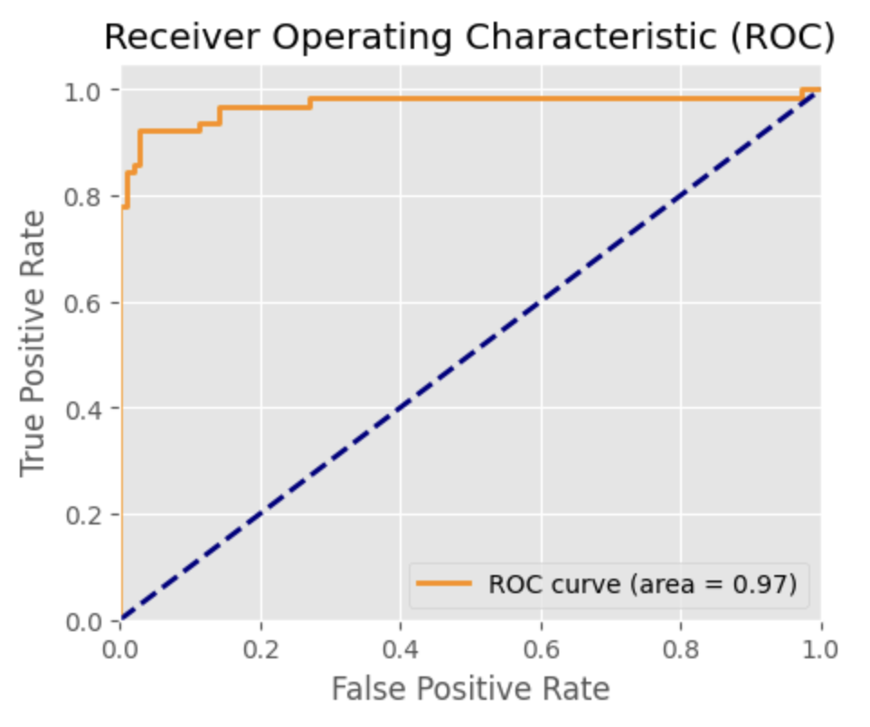
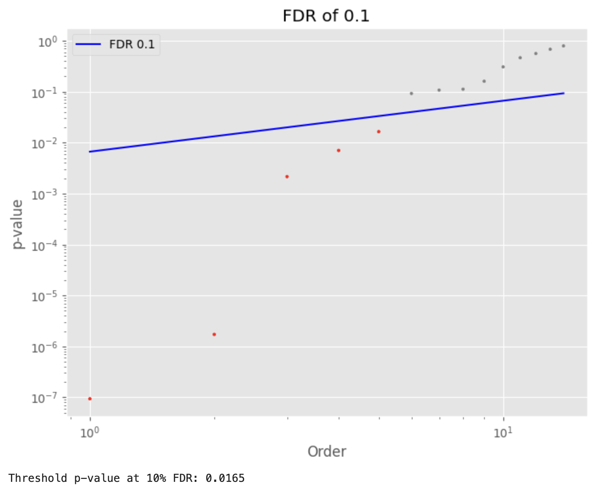
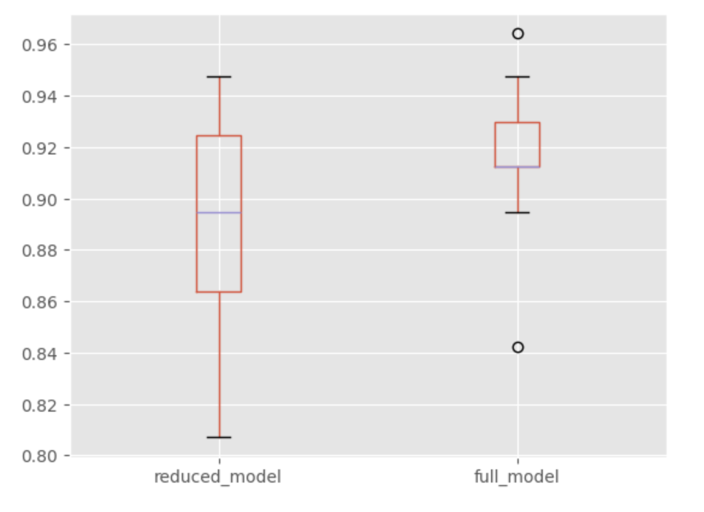

# Breast Cancer Classification Project using Logistic-Regression

## Overview
This project is focused on developing a predictive model to classify breast cancer tumors as either malignant or benign. Utilizing the Breast Cancer Dataset, which comprises features computed from digitized images of fine needle aspirates of breast masses, we aim to leverage machine learning techniques to aid in early and accurate diagnosis. The project encompasses data exploration, model development with logistic regression, model evaluation, testing interactions between features, and feature selection with cross-validation to compare full versus reduced models.

## Dataset Description
The Breast Cancer Dataset contains 569 rows and 33 variables.

## Project Structure

1. Data Exploration and Visualization
- Initial analysis of the dataset to understand the distribution and characteristics of features.
Visualization techniques like histograms, scatter plots, and box plots were employed to explore the data further.
Insights into feature distributions and their relationship with the target variable (diagnosis) were drawn, showing clear separation between classes in some variables.
2. Logistic Regression Model Development
- A logistic regression model was developed to predict the diagnosis (malignant or benign) based on the dataset features.
Data preprocessing steps included handling of missing values (none were found), encoding of categorical variables, and feature scaling.
The process of model development, including the rationale behind chosen preprocessing steps, is detailed.
3. Model Evaluation
- The logistic regression model's performance was assessed using accuracy, R^2, and RMSE metrics on out-of-sample data.
A split of the dataset into training and testing sets facilitated the evaluation, ensuring an unbiased assessment of model effectiveness.
4. Testing Interactions Between Features
- Interaction between features was explored, particularly focusing on the effects of combining categorical/dummy variables with continuous variables.
A linear regression model was experimented with to understand the implications of feature interactions, noting the challenges of using linear regression for binary outcomes.
Significant interactions were identified and discussed, providing insights into the dataset's complexities.
5. Feature Selection and Cross-Validation: Full vs. Reduced Model
- A reduced model was created using significant predictors identified through feature selection techniques.
Both full and reduced models were evaluated using 10-fold cross-validation, comparing their out-of-sample performance.
The analysis concluded with the reduced model being favored for its simplicity and competitive performance, adhering to the principle of parsimony.

## Main Highlights and Outcomes

- Dataset Analysis: The dataset showed no missing values, and aside from the target variable, all features were numerical. A roughly 60:40 split between benign and malignant classes indicated a balanced dataset.

- Model Performance: The logistic regression model achieved high precision (0.95) and recall (0.88) for the positive (malignant) class, with an ROC of 0.97, indicating excellent model performance.

  

- Feature Selection: The implementation of the False Discovery Rate (FDR) control helped in selecting the most significant features, reducing the model from 15 to 5 predictors without substantially decreasing accuracy.

- Cross-Validation Results: The full model showed a mean accuracy of 0.91, compared to 0.89 for the reduced model. Despite the reduction in variables, the minimal loss in accuracy suggests the reduced model's efficiency and generalizability.

- Final Model Selection: Given its simplicity and robust performance, the reduced model was selected as the final model, demonstrating that a parsimonious approach can achieve high accuracy in predicting breast cancer diagnoses.

## Conclusion
This project underscores the potential of machine learning in enhancing diagnostic accuracy for breast cancer. Through careful data analysis, model development, and feature selection, we've demonstrated that a reduced logistic regression model can effectively classify tumors with high accuracy, offering a valuable tool for medical professionals in diagnosing and treating breast cancer.

